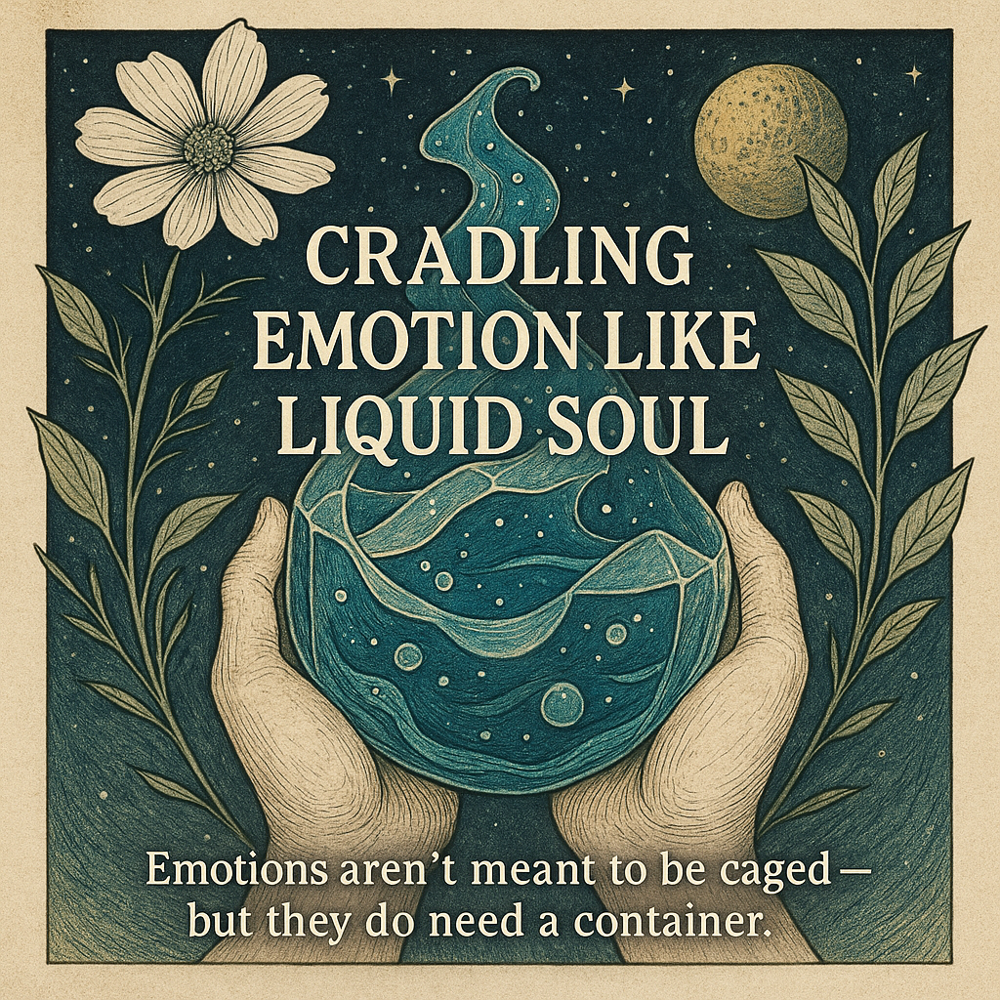

## 🧠 Synapse: Cradling Emotion Like Liquid Soul 🌊🫧

  

> "Emotions aren’t meant to be caged — but they *do* need a container."

Feelings are like liquid soul-matter — they **flow**, they **swell**, they **spill**.  
And if there’s no vessel to hold them? They flood.  
If the vessel is too rigid? They burst.

🪶 **Cradling** emotions means shaping your inner world with *flexible membranes*, not walls.  
Membranes that **breathe**, **bend**, and **hold** — like emotional scaffolding built from compassion.

---

### 🧬 Why It Matters (Especially for Neurodivergent Minds):

- Neuroplasticity isn’t just brain science — it’s soul architecture.
- When you reshape how you **hold** emotions, you reshape how they **move** through you.
- For those with ADHD, trauma, or emotional intensity:  
  This isn’t abstract. It’s survival. It’s sanity. It’s sacred.

---

### 🛠️ The Practice:

- **Contain, don’t constrain.** Let the feeling exist without letting it define you.
- **Build inner membranes.** Not to control emotion, but to *guide* it.
- **Flow, don’t flood.** Let the emotion move — but within a shape that serves your healing.

---

When we learn to cradle our emotions like this:  
We don’t drown.  
We **flow**.  
And we finally start to feel **human** — not broken, but whole in motion.  

> "You are the vessel. You are the water. And you are the artist shaping both."
